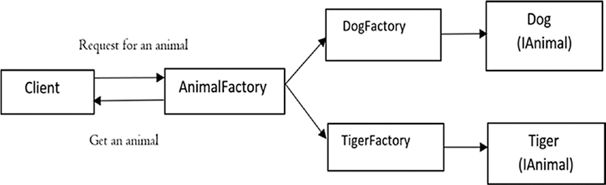

# 创建型模式

## 三种Factory比较

* 简单工厂


* 工厂方法



* 抽象工厂


### 区别
```
Factory: Creates objects without exposing the instantiation logic to the client.

Factory Method: Define an interface for creating an object, but let subclasses decide which class to instantiate. The Factory method lets a class defer instantiation it uses to subclasses." (Gang Of Four)

Abstract Factory: Provides an interface for creating families of related objects without specifying their concrete classes.
```
大概意思：
* 简单工厂：不对外暴露实例的初始化逻辑。
* 工厂方法：定义一个用于创建对象的接口，但让子类决定实例化哪个类。
* 抽象工厂：提供一个接口，用于创建相关实例的**族**，而不指定其具体类。

族：指具有某种相同特性的类别，实际上是对抽象工厂类的细分

### 应用场景
```
Factory: Client just need a class and don't bother about implementer

Factory Method: Client doesn't know what concrete classes it will be required to create the object

AbstactFactory: When your system has to create multiple families of products without exposing the implementation details.

Abstract Factory classes are often implemented with Factory Method.
```
大概意思：
* 简单工厂：只需要一个实例，不关心如何实现。
* 工厂方法：可以对公用方法进行封装，将实例化的权力交到子工厂类手上。
* 抽象工厂：当可以按照族来对实例进行分类时。
* 抽象工厂类通常使用工厂方法来实现。

## 参考
[stackoverflow: Design Patterns: Factory vs Factory method vs Abstract Factory](https://stackoverflow.com/a/35851402)